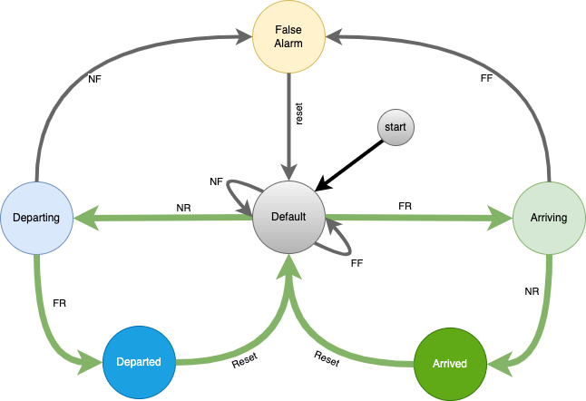

# Marty

This project is named after [Marty Feldman](https://en.wikipedia.org/wiki/Marty_Feldman) because like Marty it has two bulging "eyes".  In this case the eyes are two [PIR motion sensors](https://learn.adafruit.com/pir-passive-infrared-proximity-motion-sensor/overview) use to detect cars arriving and departing on my street. It also has a motion sensor that will alert me of mail delivery.  The unit is mounted on my mail post perfect for detecting mail delivery and watching for cars.

## State Machine

The main logic is control by a [FSM (Finite State Machine)](https://venilnoronha.io/a-simple-state-machine-framework-in-go) who's states and events are described below:

The PIR motion sensors will pull a pin high when movement is detected, therefor I listen for `PinRising` and `PinFalling` events to monitor the PIR sensors.

| Event | Description                                 |
| ----- | ------------------------------------------- |
| FR    | "Far Rising" - Far PIR `PinRising` event    |
| FF    | "Far Falling" - Far PIR `PinFalling` event |
| NR    | "Near Rising" - Near PIR `PinRising` event      |
| NF    | "Near Falling" - Near PIR `PinFalling` event   |

>Note: Any unhandled event go to the `Error` state
